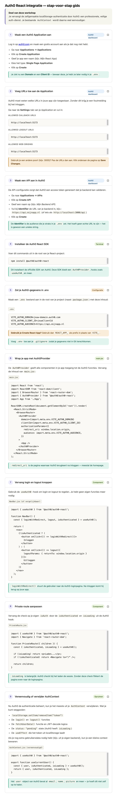

1. Maak een Auth0 Application aan op auth0.com
2. voeg Callbacks, Logout URL, Web Origins toe
3. Maak een API aan in Auth0
4. Installeer de Auth0 React SDK met npm i @auth0/auth0-react
5. Zet je Auth0-gegevens (domain, client id en audience) in .env
6. Wrap je app met Auth0Provider
7. Vervang login/logout
8. Private route aanpassen
9. Verwijder zoveel mogelijk uit je authContext

