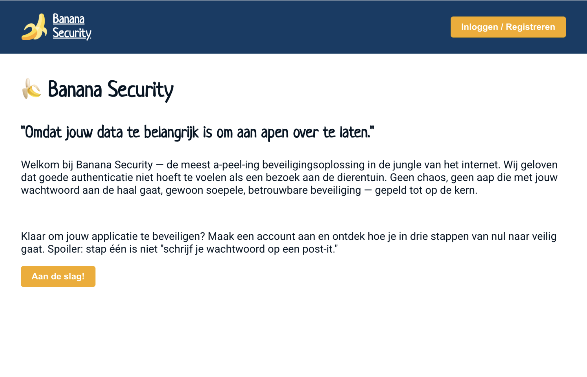
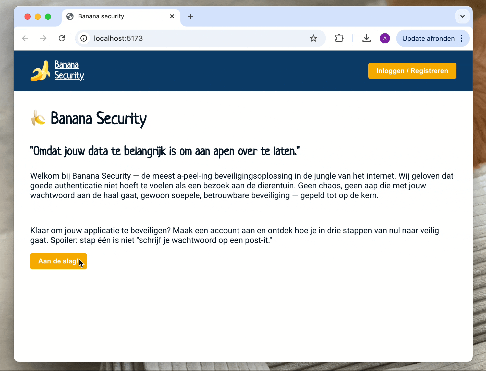

# Stappenplan om Auth0 te implementeren

1. Maak een Auth0 Application aan op auth0.com
2. voeg Callbacks, Logout URL, Web Origins toe
3. Maak een API aan in Auth0
4. Installeer de Auth0 React SDK met npm i @auth0/auth0-react
5. Zet je Auth0-gegevens (domain, client id en audience) in .env
6. Wrap je app met Auth0Provider
7. Vervang login/logout
8. Private route aanpassen
9. Verwijder zoveel mogelijk uit je authContext

Zie de [documentatie](https://auth0.com/docs/libraries/auth0-react) of [quickstart](https://auth0.com/docs/quickstart/spa/react) voor meer informatie en instructies


# Auth0 React integratie — stap-voor-stap instructie

> **Doel:** vervang de zelfgemaakte localStorage-authenticatie door Auth0 — een professionele, veilige auth-dienst. Je bestaande `AuthContext` wordt daarna veel eenvoudiger.
---
## Stap 1 — Maak een Auth0 Application aan

Log in op [auth0.com](https://auth0.com) en maak een gratis account aan als je dat nog niet hebt.

1. Ga naar **Applications → Applications**
2. Klik op **Create Application**
3. Geef je app een naam (bijv. *Mijn React App*)
4. Kies het type: **Single Page Application**
5. Klik op **Create**
> 💡 Je ziet nu een **Domain** en een **Client ID** — bewaar deze, je hebt ze later nodig in je `.env`.
 
---
## Stap 2 — Voeg URLs toe aan de Application

Auth0 moet weten welke URLs in jouw app zijn toegestaan. Zonder dit krijg je een foutmelding bij het inloggen.

Ga naar de **Settings**-tab van je Application en vul in:

| Veld | Waarde |
|------|--------|
| Allowed Callback URLs | `http://localhost:5173` |
| Allowed Logout URLs | `http://localhost:5173` |
| Allowed Web Origins | `http://localhost:5173` |

> ⚠️ Gebruik je een andere poort (bijv. 3000)? Pas de URLs dan aan. Klik onderaan de pagina op **Save Changes**.
 
---
## Stap 3 — Maak een API aan in Auth0

De API-configuratie zorgt dat Auth0 een access token genereert dat je backend kan valideren.

1. Ga naar **Applications → APIs**
2. Klik op **Create API**
3. Geef een naam op (bijv. *Mijn Backend API*)
4. Vul bij **Identifier** de URL van je backend in, bijv. `https://api.mijnapp.nl`
5. Klik op **Create**
> 💡 De **Identifier** is de *audience* die je straks in je `.env` zet. Het hoeft geen echte URL te zijn — het is gewoon een unieke string.
 
---
## Stap 4 — Installeer de Auth0 React SDK

Voer dit commando uit in de root van je React-project:

```bash
npm install @auth0/auth0-react
```
 
---
## Stap 5 — Zet je Auth0-gegevens in `.env`

Maak een `.env` bestand aan in de root van je project (naast `package.json`):

```env
VITE_AUTH0_DOMAIN=jouw-domain.auth0.com
VITE_AUTH0_CLIENT_ID=jouwClientId
VITE_AUTH0_AUDIENCE=https://api.mijnapp.nl
```

> ⚠️ Gebruik je Create React App? Gebruik dan `REACT_APP_` als prefix in plaats van `VITE_`.

> 💡 Voeg `.env` toe aan je `.gitignore` zodat je gegevens niet in Git terechtkomen.
 
---
## Stap 6 — Wrap je app met `Auth0Provider`

De `Auth0Provider` geeft alle componenten in je app toegang tot de Auth0-functies.

**`main.jsx`**
```jsx
import React from 'react';
import ReactDOM from 'react-dom/client';
import { BrowserRouter } from 'react-router-dom';
import { Auth0Provider } from '@auth0/auth0-react';
import App from './App';
 
ReactDOM.createRoot(document.getElementById('root')).render(
  <React.StrictMode>
    <BrowserRouter>
      <Auth0Provider
        domain={import.meta.env.VITE_AUTH0_DOMAIN}
        clientId={import.meta.env.VITE_AUTH0_CLIENT_ID}
        authorizationParams={{
          redirect_uri: window.location.origin,
          audience: import.meta.env.VITE_AUTH0_AUDIENCE,
        }}
      >
        <App />
      </Auth0Provider>
    </BrowserRouter>
  </React.StrictMode>
);
```

> 💡 `redirect_uri` is de pagina waarnaar Auth0 terugkeert na inloggen — meestal de homepage.
 
---
## Stap 7 — Vervang login en logout knoppen

Gebruik de `useAuth0`-hook om login en logout te regelen. Je hebt geen eigen functies meer nodig.

**`NavBar.jsx`** (of vergelijkbaar)
```jsx
import { useAuth0 } from '@auth0/auth0-react';
 
function NavBar() {
  const { loginWithRedirect, logout, isAuthenticated } = useAuth0();
 
  return (
    <nav>
      {!isAuthenticated ? (
        <button onClick={() => loginWithRedirect()}>
          Inloggen
        </button>
      ) : (
        <button onClick={() => logout({
          logoutParams: { returnTo: window.location.origin }
        })}>
          Uitloggen
        </button>
      )}
    </nav>
  );
}
```

> 💡 `loginWithRedirect()` stuurt de gebruiker naar de Auth0-loginpagina. Na inloggen komt hij terug op jouw app.
 
---
## Stap 8 — Private route aanpassen

Vervang de check op je eigen `isAuth` door `isAuthenticated` en `isLoading` uit de Auth0 hook.

**`PrivateRoute.jsx`**
```jsx
import { useAuth0 } from '@auth0/auth0-react';
import { Navigate } from 'react-router-dom';
 
function PrivateRoute({ children }) {
  const { isAuthenticated, isLoading } = useAuth0();
 
  if (isLoading) return <p>Laden...</p>;
  if (!isAuthenticated) return <Navigate to="/" />;
 
  return children;
}
```

> 💡 `isLoading` is belangrijk: Auth0 checkt bij het laden de sessie. Zonder deze check flikkert de pagina even naar de loginpagina.
 
---
## Stap 9 — Vereenvoudig of verwijder `AuthContext`

Nu Auth0 de authenticatie beheert, kun je het meeste uit je `AuthContext` verwijderen.

**Wat je kunt weggooien:**

- `localStorage.setItem/removeItem("token")`
- De `login()` en `logout()` functies
- De `fetchUserData()` functie en JWT-decode logica
- De `status: "pending"` state — Auth0 heeft hiervoor `isLoading`
- De `useEffect` die het token uit localStorage laadt
  Als je nog extra gebruikersdata nodig hebt (bijv. uit je eigen backend), kun je een kleine context bewaren:

**`AuthContext.jsx`** (vereenvoudigd)
```jsx
import { useAuth0 } from '@auth0/auth0-react';
 
export function useCurrentUser() {
  const { user, isAuthenticated, isLoading } = useAuth0();
  return { user, isAuthenticated, isLoading };
}
```

> 💡 Het `user`-object van Auth0 bevat al `email`, `name`, `picture` en meer — je hoeft dit niet zelf op te halen.
 
---
## Verschil met localStorage-authenticatie

| | localStorage-auth         | Auth0                              |
|--|---------------------------|------------------------------------|
| Tokens opslaan | Handmatig in localStorage | Auth0 beheert dit veilig           |
| Sessie controleren | `useEffect` + `jwtDecode` | `isLoading` + `isAuthenticated`    |
| Login/logout | Eigen functies            | `loginWithRedirect()` / `logout()` |
| Beveiliging | Kwetsbaar voor XSS        | Veilig via Auth0-sessie            |


---

## Preview

<details>
<summary><strong>Home</strong></summary>  


</details>  



> This demo shows the banana security project.


---